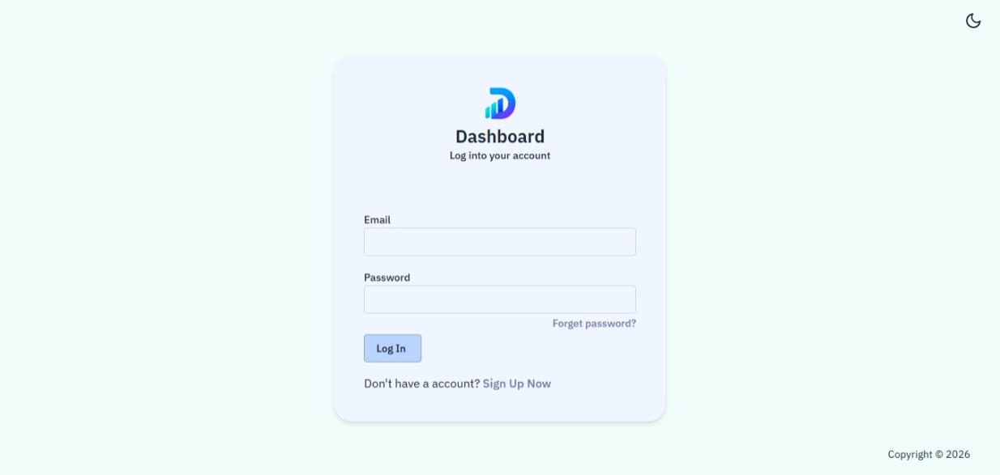

<h1 align="center">🚀 React Admin Dashboard</h1>

<p align="center">
  A modern, scalable, and fully responsive dashboard template built with <b>React</b>, <b>TypeScript</b>, and <b>Tailwind CSS</b>.
</p>

<p align="center">
  <a href="https://react.dev/">React</a> •
  <a href="https://www.typescriptlang.org/">TypeScript</a> •
  <a href="https://redux-toolkit.js.org/">Redux Toolkit</a> •
  <a href="https://reactrouter.com/">React Router</a> •
  <a href="https://tailwindcss.com/">Tailwind CSS</a> •
  <a href="https://vitejs.dev/">Vite</a>
</p>

---

## 📸 Project Screenshots

<p align="center">
  
  
</p>

<p align="center">
  
  
</p>

---

## ✨ Features

- Fully responsive layout (mobile, tablet, desktop)
- Reusable and modular component architecture
- Type-safe development with React + TypeScript
- State management using Redux Toolkit
- Fast development workflow powered by Vite
- Clean and maintainable UI architecture
- Routing with React Router DOM v6
- Reusable UI component system
- Authentication pages (Login & Register)
- Ready for API integration

---

## 🧰 Tech Stack

| Technology | Description |
|---|---|
| React | Frontend UI library |
| TypeScript | Type-safe JavaScript |
| Redux Toolkit | State management |
| React Router DOM | Routing system |
| Tailwind CSS | Utility-first styling |
| Vite | Fast development tooling |

---

## 📦 Installation

### Clone the repository

```bash
git clone https://github.com/EraCodeX/react-admin-dashboard.git
```

---

### Navigate to the project

```bash
cd react-admin-dashboard
```

---

### Install dependencies

```bash
npm install
```

or

```bash
yarn
```

---

### Start the development server

```bash
npm run dev
```

or

```bash
yarn dev
```

---

Application will be available at:

```bash
http://localhost:3000
```

---

## 🔑 Environment Variables

Create a `.env` file in the project root:

```env
DASHBOARD_API=http://localhost:3001/api
```

---

## 📁 Folder Structure

```bash
src
├── assets
├── components
├── data
├── hooks
├── pages
├── store
│   ├── api
│   ├── hooks
│   ├── reducers
│   └── index.ts
├── types
├── util
├── App.tsx
├── index.css
└── main.tsx
```

---

## 🎨 UI Highlights

- Modern dashboard interface
- Authentication system
- Reusable button components
- Dropdown UI components
- Responsive sidebar navigation
- Custom loading spinners
- Scalable frontend architecture
- Consistent design system

---

## ⚡ Performance

- Optimized rendering patterns
- Reusable component architecture
- Lightweight and fast development workflow
- Clean separation of concerns
- Scalable project structure

---

## 👩‍💻 Author

### Era Hidaj — Frontend Engineer

GitHub:  
https://github.com/EraCodeX

---

## 📄 License

This project is licensed under the **MIT License**.

See the `LICENSE` file for more details.