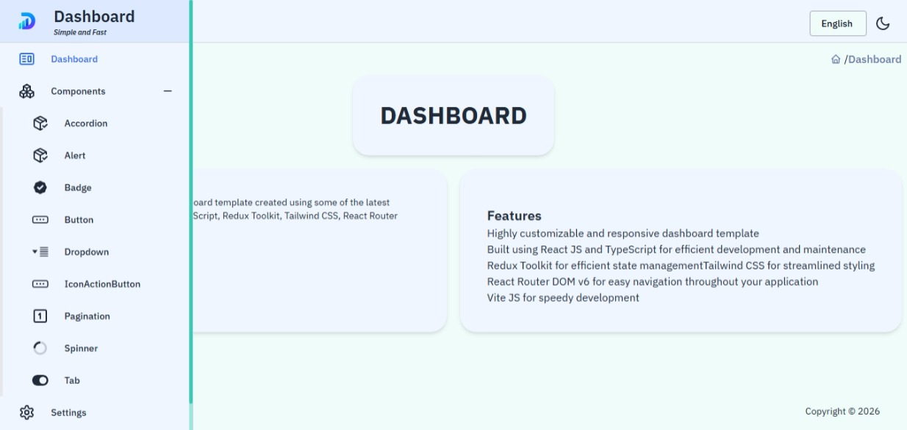
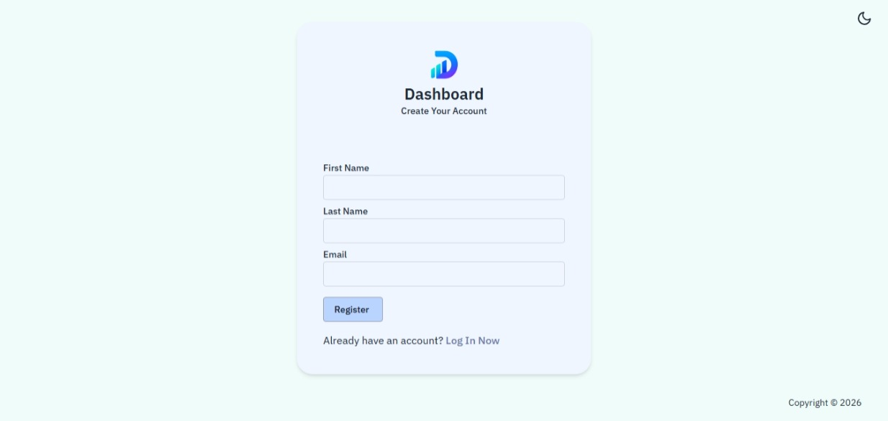
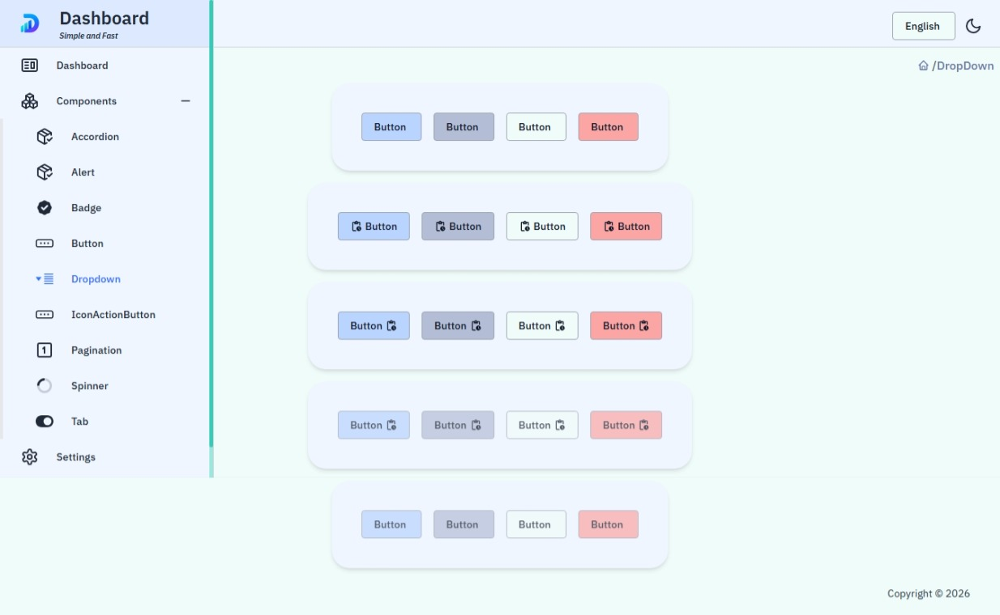

<h1 align="center">🚀 React Dashboard Template</h1>

<p align="center">
  A modern, flexible, and fully responsive dashboard template built with <b>React</b>, <b>TypeScript</b>, and <b>Tailwind CSS</b>.
</p>

<p align="center">
  <a href="https://react.dev/">React</a> •
  <a href="https://www.typescriptlang.org/">TypeScript</a> •
  <a href="https://redux-toolkit.js.org/">Redux Toolkit</a> •
  <a href="https://reactrouter.com/">React Router</a> •
  <a href="https://tailwindcss.com/">Tailwind CSS</a> •
  <a href="https://vitejs.dev/">Vite</a>
</p>

<p align="center">
  
</p>

<hr />

<h2>📸 Project Screenshots</h2>

<table>
  <tr>
    <td width="50%">
      
    </td>

    <td width="50%">
      
    </td>
  </tr>

  <tr>
    <td width="50%">
      
    </td>

    <td width="50%">
      
    </td>
  </tr>
</table>

<hr />

<h2>✨ Features</h2>

<ul>
  <li>Fully responsive layout (mobile, tablet, desktop)</li>
  <li>Reusable, modular component architecture</li>
  <li>Type-safe development with React + TypeScript</li>
  <li>State management with Redux Toolkit</li>
  <li>Fast dev & build workflow using Vite</li>
  <li>Clean UI styling with Tailwind CSS</li>
  <li>Routing with React Router DOM v6</li>
  <li>Ready for API integration</li>
</ul>

<hr />

<h2>🧰 Tech Stack</h2>

<ul>
  <li><a href="https://react.dev/">React</a></li>
  <li><a href="https://www.typescriptlang.org/">TypeScript</a></li>
  <li><a href="https://redux-toolkit.js.org/">Redux Toolkit</a></li>
  <li><a href="https://reactrouter.com/">React Router</a></li>
  <li><a href="https://tailwindcss.com/">Tailwind CSS</a></li>
  <li><a href="https://vitejs.dev/">Vite</a></li>
</ul>

<hr />

<h2>📦 Installation</h2>

<ol>
  <li>
    Clone the repository:

```bash
git clone https://github.com/EraCodeX/react-admin-dashboard.git
```

  </li>

  <li>
    Install dependencies:

```bash
npm install
```

<p>or</p>

```bash
yarn
```

  </li>

  <li>
    Start the development server:

```bash
npm run dev
```

<p>or</p>

```bash
yarn dev
```

  </li>
</ol>

<p>The application will be available at:</p>

```bash
http://localhost:3000
```

<hr />

<h2>🔑 Environment Variables</h2>

<p>Create a <code>.env</code> file in the project root:</p>

```env
DASHBOARD_API=http://localhost:3001/api
```

<hr />

<h2>📁 Folder Structure</h2>

```bash
src
├── assets
├── components
├── data
├── hooks
├── pages
├── store
│   ├── api
│   ├── hooks
│   ├── reducers
│   └── index.ts
├── types
├── util
├── App.tsx
├── index.css
└── main.tsx
```

<hr />

<h2>🎨 UI Highlights</h2>

<ul>
  <li>Modern dashboard interface</li>
  <li>Authentication pages</li>
  <li>Reusable button system</li>
  <li>Dropdown components</li>
  <li>Responsive sidebar navigation</li>
  <li>Custom loading spinners</li>
  <li>Scalable component structure</li>
</ul>

<hr />

<h2>⚡ Performance</h2>

<ul>
  <li>Optimized rendering architecture</li>
  <li>Reusable component patterns</li>
  <li>Fast development workflow with Vite</li>
  <li>Clean separation of concerns</li>
  <li>Scalable project structure</li>
</ul>

<hr />

<h2>👩‍💻 Author</h2>

<p>
  <b>Era Hidaj</b> — Frontend Engineer <br /><br />

  GitHub:
  <a href="https://github.com/EraCodeX">
    github.com/EraCodeX
  </a>
</p>

<hr />

<h2>📄 License</h2>

<p>
  This project is licensed under the <b>MIT License</b>.
  See the <code>LICENSE</code> file for details.
</p>


